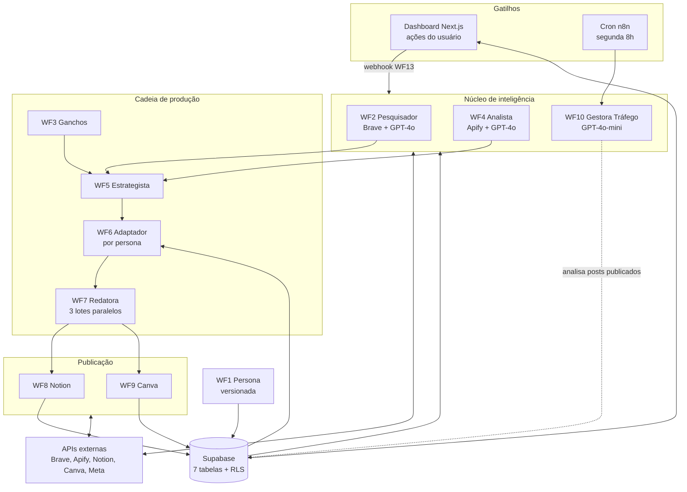

# MNS Creator

> **Sistema de produção de conteúdo com IA.**
> Pesquisa tendências, escreve roteiros completos e publica no calendário editorial, automaticamente, toda semana, no tom exato de cada perfil.
> Construído pela Mind in Shift pra operar internamente nos 3 perfis da agência (institucional, sócia, gestor técnico) antes de qualquer venda externa.

   

> 📌 Este repositório é um case study técnico do MNS Creator. O código-fonte é fechado. Aqui você encontra arquitetura, decisões técnicas, decisões em aberto, estado real do desenvolvimento e os riscos mapeados.

---

## O problema

Manter consistência editorial em mais de um perfil de Instagram simultaneamente é caro. Cada perfil precisa de pesquisa de tendência, definição de pauta, roteiro original, publicação no calendário, briefing de criativo e leitura de métricas pra ajuste. Pra um perfil só, dá pra fazer no braço. Pra três, vira inviável sem contratar time de social media.

A primeira reação intuitiva é automatizar com IA. Só que aí aparece o segundo problema: **conteúdo gerado por IA genérica sai genérico**. ChatGPT escreve no mesmo tom pra todo mundo. Notion AI faz frases passáveis. Nenhum dos dois preserva a voz individual de cada perfil, e nenhum dos dois faz a cadeia completa de pesquisa, roteiro e publicação automatizada.

A Mind in Shift opera 3 perfis simultâneos com necessidades editoriais distintas:

- **Institucional da agência.** Tom corporativo, foco em automação e IA, frequência semanal.
- **Perfil da sócia.** Tom mais pessoal, criadora de conteúdo, foco em design e processo.
- **Perfil do gestor técnico.** Tom mais aberto, mistura de técnico com pessoal, foco em construção e bastidor.

Sem o MNS Creator, manter os 3 ativos exigia 2 horas por dia das duas pessoas que operam a agência. Tempo que ia direto do operacional dos clientes.

## A solução

Sistema completo de produção de conteúdo orquestrado em 13 workflows do n8n. Recebe gatilho semanal, executa a cadeia inteira (pesquisa → análise → estratégia → redação → publicação → briefing visual → análise de tráfego pago) e devolve calendário editorial pronto pra revisão e aprovação pelo dashboard.

A diferença em relação a soluções genéricas: **a persona de cada perfil é construída via entrevista estruturada e persistida no banco**. Não é prompt na hora de gerar. Cada chamada ao modelo recebe a persona ativa do perfil em questão, montada em tempo de execução por um nó Code antes de chegar ao GPT-4o.

### Os 3 agentes principais

Dos 13 workflows, três são o núcleo de inteligência do sistema. Cada um responde por uma camada distinta da cadeia.

**Pesquisador de Tendências (WF2).** Executa buscas reais via Brave Search API com filtro Brasil/PT-BR nas 4 áreas de atuação da agência (automação, IA, marketing digital, design). GPT-4o sintetiza um relatório estruturado com tendências do momento, dúvidas frequentes do público e 5 ideias de conteúdo por área. Roda sob demanda antes de cada ciclo de produção semanal.

**Analista de Perfil e Concorrentes (WF4).** Acessa dados reais dos perfis via Apify Instagram Scraper. Calcula taxa de engajamento, distribuição de formatos, frequência, top horários e top ganchos por engajamento. Faz o mesmo pra até 3 concorrentes por nicho e entrega relatório com gaps, oportunidades e plano de ação de 30 dias.

**Gestora de Tráfego (WF10).** Analisa os posts da semana, pontua cada um de 0 a 100 no potencial pra Meta Ads e seleciona os 5 a 7 melhores. Pra cada selecionado entrega briefing completo: objetivo, público-alvo detalhado, copy do criativo, orçamento por fase, configurações técnicas do Meta Ads e alertas antes de subir a campanha.

### Pipeline semanal

| # | Workflow | Função | Status |
|---|---|---|---|
| WF1 | Persona | Entrevista estruturada gera persona persistida no banco. Versionada (nova entrevista gera nova versão sem apagar a anterior). | Em produção |
| WF2 | Pesquisador | Brave Search + GPT-4o. Sintetiza tendências por área de atuação. | Em produção |
| WF3 | Ganchos | Apify coleta 12 posts por perfil. Identifica ganchos por engajamento. | Em produção |
| WF4 | Analista | Apify coleta 30 posts por perfil + concorrentes. Calcula métricas e gaps. | Em produção |
| WF5 | Estrategista | Define direção semanal consumindo WF2 + WF4 (com `neverError: true`). | Em produção |
| WF6 | Adaptador | Adapta direção semanal pra cada perfil considerando persona individual. | Em produção |
| WF7 | Redatora | 3 lotes paralelos. GPT-4o gera roteiros completos por perfil. | Em produção |
| WF8 | Publicadora Notion | Publica calendário editorial no Notion via API. | Em produção |
| WF9 | Briefing Canva | Cria designs no Canva Connect API com briefing estruturado. | Em produção |
| WF10 | Gestora de Tráfego | Pontua posts pra Meta Ads. Briefing completo pros selecionados. | Em produção |
| WF11 | Score e Consistência | Cron segunda 8h. Mede saúde dos perfis. | Em construção |
| WF12 | Repurposing | Reaproveita conteúdo de alta performance em formatos novos. | Em construção |
| WF13 | Webhooks Dashboard | Conecta ações do dashboard (aprovar, rejeitar, salvar vivência) ao n8n. | Em construção |

### Dashboard

Web app em Next.js 15 + TypeScript + Tailwind, deploy no Vercel. Login único, identidade visual diferenciada por perfil (cor, tipografia e mood próprios em cada um, não uma interface genérica com 3 abas).

Design system desenvolvido pela Micaela: Cormorant Garamond nos títulos, Inter no corpo, fundo escuro quente, dourado `#C9A84C` como cor primária. A interface foi projetada por quem vai usar.

Telas: Posts da Semana, Calendário Editorial, Diário de Vivências (campo que a redatora WF7 lê antes de escrever os roteiros), Métricas, Tráfego Pago, Relatório Semanal e Perfil.

Interação é operacional, não conversacional. O usuário aprova post, rejeita (dispara reescrita automática), abre link do Canva, salva vivência da semana. Cada ação dispara um webhook pro n8n via WF13.

---

## Arquitetura

### Camadas

| Camada | Tecnologia | Versão |
|---|---|---|
| Dashboard | Next.js + TypeScript + Tailwind | v15 |
| Orquestração | n8n self-hosted | atual |
| Modelo principal | OpenAI GPT-4o (estratégia, redação, análise) | API |
| Modelo de avaliação | OpenAI GPT-4o-mini (score, briefings, ganchos) | API |
| Pesquisa | Brave Search API com filtro BR/PT-BR | API |
| Scraping Instagram | Apify Instagram Scraper (actor `apify/instagram-scraper`) | API |
| Publicação editorial | Notion API | API |
| Visual | Canva Connect API | API |
| Banco | Supabase PostgreSQL (região São Paulo) | v16 |
| Hospedagem dashboard | Vercel | n/a |
| Hospedagem n8n | VPS Hostinger Ubuntu + Docker Swarm | n/a |

### Schema do banco

7 tabelas no Supabase com RLS configurado e triggers de `updated_at`:

- **`users`**. Usuários do dashboard. Login único.
- **`persona_templates`**. Templates de entrevista estruturada (perguntas que o WF1 faz).
- **`personas`**. Personas geradas pelas entrevistas, versionadas por perfil. O sistema sempre usa a versão ativa.
- **`diario_vivencias`**. Campo que o usuário preenche semanalmente. A WF7 Redatora lê antes de escrever os roteiros, pra dar contexto pessoal.
- **`post_tracking`**. Posts gerados, status (rascunho, aprovado, publicado), engagement quando aplicável.
- **`weekly_reports`**. Relatórios semanais consolidados por perfil.
- **`execution_logs`**. Log estruturado de toda execução de workflow (sucesso, erro, payload).

Mais um storage bucket pra ativos visuais.

---

## Decisões técnicas

Algumas escolhas valeram debate antes de virar código.

### 1. Persona persistida em banco, não em prompt

**Decisão.** A persona de cada perfil é gerada via entrevista estruturada (WF1), persistida no Supabase e versionada. Cada chamada ao GPT-4o monta o contexto via nó Code, lendo a versão ativa da persona do perfil em questão.

**Por quê.** A voz de um criador evolui. Persona dentro do prompt fica congelada no momento que foi escrita; persona em banco evolui com novas entrevistas sem precisar mexer em workflow. O versionamento mantém histórico (cada nova entrevista gera versão nova, a anterior não some) e permite rollback se a nova versão sair pior.

**Trade-off.** Mais uma leitura ao banco por execução. Latência adicional desprezível pro nosso caso, mas em escala industrial precisaria de cache.

**Refaria.** Sim. Persona estática em prompt seria insustentável pra um sistema que vai operar por anos.

### 2. n8n self-hosted, não framework de agentes (Mastra, LangGraph, AutoGen)

**Decisão.** Toda a orquestração no n8n self-hosted, mesma stack do resto da agência (Docker Swarm + Postgres + Redis).

**Por quê.** Já tenho operação consolidada em n8n. 13 workflows visualmente conectados, debugáveis nó a nó, com histórico de cada execução, valem mais que código abstrato em framework de agentes que ainda tá amadurecendo. Editor visual também permite a Micaela navegar nos fluxos sem precisar entender código.

**Trade-off.** Em algumas cadeias específicas (loops complexos com decisão dinâmica), framework de agente seria mais natural. n8n exige modelar com Switch + IF, o que infla o número de nós.

**Refaria.** Sim. Diversidade de stack só faz sentido quando o problema justifica. Não justifica aqui.

### 3. Apify pro Instagram, não scraper próprio

**Decisão.** Coleta de dados do Instagram via Apify Instagram Scraper (HTTP Request com credencial `httpHeaderAuth`, actor `apify/instagram-scraper`, `resultsType: posts`).

**Por quê.** Risco terceirizado. Scraping de Instagram é guerra contínua (Meta muda DOM, bloqueia IPs, exige login). Manter scraper próprio é trabalho permanente que não agrega valor pra agência. Apify mantém o actor atualizado e a gente paga só pelas coletas (não chamadas contínuas).

**Trade-off.** Custo recorrente (cerca de US$ 0,15 por 1000 posts coletados). Pra uso interno é viável. Pra escalar pra cliente, mapear no modelo de precificação.

**Refaria.** Sim. Tempo gasto mantendo scraper próprio sairia muito mais caro que a assinatura.

### 4. Split de modelos GPT-4o + GPT-4o-mini, não modelo único

**Decisão.** GPT-4o nas tarefas criativas e estratégicas (Pesquisador WF2, Estrategista WF5, Redatora WF7). GPT-4o-mini nas avaliações estruturadas (Score, Briefings, Ganchos).

**Por quê.** Custo. Score de post pra Meta Ads é tarefa estruturada com saída em formato fixo; GPT-4o-mini resolve com qualidade equivalente por uma fração do preço. Já redação de roteiro precisa do raciocínio mais profundo do GPT-4o.

**Trade-off.** Mais um modelo no inventário, mais um teste de regressão quando o split muda.

**Refaria.** Sim. Em escala, a diferença de custo paga muito.

### 5. Tratamento de erro com `neverError: true` nas chamadas em cascata

**Decisão.** WF5 Estrategista chama WF2 (Pesquisador) e WF4 (Analista) com `neverError: true` no nó Execute Workflow.

**Por quê.** A cadeia inteira tem 13 workflows. Se qualquer chamada quebrar e abortar o pipeline, a produção semanal não acontece. `neverError: true` faz a quebra propagar como dado (`{ "error": ... }`), que a WF5 trata com lógica condicional. O ciclo segue com o que tem.

**Trade-off.** Se a falha for grave (ex: Brave Search retornou vazio por bug crítico), o ciclo segue com dados ruins até alguém perceber. Compensado pelo log estruturado no Supabase, que dispara alerta em erros recorrentes.

**Refaria.** Sim. Cadeia em cascata sem fallback é frágil demais pra produção real.

---

## Decisões ainda em aberto

Diferente das decisões fechadas, essas precisam ser tomadas antes do go-live ou pouco depois.

### IDs do Notion: env vars ou hardcode

O n8n bloqueia acesso a `$env` nos Code nodes por padrão (`N8N_BLOCK_ENV_ACCESS_IN_NODE=true`). Pra usar IDs dos 3 bancos Notion via env:

- **Opção A.** Desativar `N8N_BLOCK_ENV_ACCESS_IN_NODE` no host e usar `.env`. Código fica limpo, IDs fora do workflow.
- **Opção B.** Hardcodar os 3 IDs no Code Setup Perfil. Não exige mudar config global.

**Tendência:** A. Manter código limpo e IDs separados.

### Canva API: criação programática completa ou briefing manual

A Canva Connect API ainda tem suporte limitado pra criação programática de design com conteúdo real. O WF9 hoje cria o design mas não preenche os slides automaticamente.

- **Opção A.** Manter como está: briefing estruturado + link pra editar manualmente. Sem dependência de feature instável da Canva.
- **Opção B.** Investigar Canva API v2 com template preenchimento.
- **Opção C.** Substituir Canva por geração de imagem via Firefly ou DALL-E direto.

**Tendência:** manter A no MVP, avaliar B depois do primeiro ciclo de produção.

### Quando rodar o happy path completo com personas reais

Todos os workflows foram validados individualmente. O caminho completo WF1 → WF7 nunca foi executado de ponta a ponta porque a tabela `personas` está vazia (ainda não fizemos as entrevistas com cada perfil).

- **Opção A.** Rodar antes do WF13 (sem dashboard conectado). Validação mais rápida, mas operação manual.
- **Opção B.** Esperar WF13 terminar pra ter o dashboard conectado na primeira validação real.

**Tendência:** B. Vale esperar uma semana pra ter validação completa do fluxo dashboard → n8n → publicação no Notion.

---

## Estado atual

**Em pré-lançamento. Go-live interno em 20 de junho de 2026.**

| Indicador | Valor |
|---|---|
| Workflows em produção | **10 de 13** |
| Workflows em construção | WF11 (Score), WF12 (Repurposing), WF13 (Webhooks Dashboard) |
| Tabelas Supabase prontas | 7 (com RLS, triggers e storage bucket) |
| Dashboard | HTML completo com design system implementado |
| Personas no banco | 0 (entrevistas planejadas pra próxima semana) |
| Primeiro ciclo real | 20/06/2026 |

### O que cada um cuida

- **Guilherme.** Infraestrutura, n8n, integrações de API, schema Supabase, workflows.
- **Micaela.** Dashboard Next.js, design system, copy do produto.

### Cadência de desenvolvimento

6 horas por semana, divididas em 2 blocos: 3 horas segunda + 3 horas quinta. O projeto roda em paralelo à operação da agência (clientes em produção via MNS Control + Sistema de Prospecção).

---

## Riscos conhecidos

### 1. Instagram bloqueando ou alterando scraping via Apify

**Mitigação.** Fallback manual: o usuário pode inserir métricas diretamente no diário de vivências do dashboard. O sistema continua funcionando sem o WF4, com perda só do enriquecimento por dados reais de concorrentes.

### 2. Cadeia em cascata fragiliza a produção semanal

13 workflows acoplados. Um quebrado para o ciclo todo.

**Mitigação.** Todos os workflows têm tratamento de erro por nó, log estruturado no Supabase com payload de execução, e as chamadas críticas usam `neverError: true` (decisão técnica 5 acima).

### 3. Tempo de execução do projeto

6h por semana é pouco pra um sistema de 13 workflows + dashboard + design system. Risco real de o cronograma atrasar.

**Mitigação.** Arquitetura em batches com entrega incremental. O sistema já produz valor antes de estar 100% completo: hoje a parte de pesquisa + análise + estratégia + redação já roda, mesmo sem WF11/12/13 prontos.

### 4. Custo de API com escala

GPT-4o por post, Apify por coleta, Brave Search por busca. Pra uso interno (3 perfis, ciclo semanal) o custo é controlado. Pra escalar pra cliente externo, o custo por execução precisa ser mapeado antes de precificar.

**Mitigação.** Split de modelos (decisão técnica 4) já reduz custo. Mapeamento detalhado por workflow será feito após o primeiro ciclo real.

### 5. Personas desatualizadas no tempo

A voz de um criador evolui. Se a persona não for atualizada, o conteúdo começa a soar deslocado depois de alguns meses.

**Mitigação.** Versionamento de persona (decisão técnica 1) permite atualização sem perda histórica. Pendente: alerta automático pra revisar persona após X meses sem atualização.

---

## Roadmap

### Próximos 3 meses

- Go-live do sistema completo com os 3 perfis produzindo conteúdo real semanalmente
- Dashboard integrado com dados reais do Supabase (substituir mocks)
- Primeiro ciclo de 4 semanas validado, medindo taxa de aprovação dos posts, tempo economizado e consistência de publicação
- WF11, WF12 e WF13 fechados

### 6 a 12 meses

- Dados acumulados suficientes pra medir impacto real no crescimento dos perfis
- Avaliar productização: documentar o sistema, mapear custo por cliente, definir modelo de implementação pra terceiros
- Se validado, primeiro cliente externo com implementação gerenciada pela Mind in Shift

---

## Posicionamento e modelo

Uso interno primeiro. A Mind in Shift vai usar o MNS Creator pra produzir o próprio conteúdo dos 3 perfis. Quando o sistema estiver validado em produção real (provavelmente após 8 a 12 semanas de operação contínua), avaliar produtização pra terceiros.

Modelo igual ao MNS Control: não é SaaS standalone vendido por licença. Seria implementação gerenciada pela agência, com setup consultivo (entrevistas pra construir personas, configuração de credenciais, conexão dos perfis) e operação mensal.

Perfil do primeiro cliente externo viável: agência de marketing digital pequena, com 2 a 3 sócios produzindo conteúdo simultâneo, que já usa n8n ou está aberta a automação, e que sofre com inconsistência editorial entre perfis.

---

## Stack

- **Dashboard.** Next.js 15, TypeScript, Tailwind CSS, deploy Vercel
- **Orquestração.** n8n self-hosted (3 services: editor, worker, webhook) em Docker Swarm
- **Modelo IA.** OpenAI GPT-4o (criativo) e GPT-4o-mini (avaliações estruturadas)
- **Pesquisa.** Brave Search API com filtro BR/PT-BR
- **Scraping.** Apify Instagram Scraper
- **Banco.** Supabase PostgreSQL v16 (região São Paulo), 7 tabelas com RLS, triggers e storage bucket
- **Publicação editorial.** Notion API
- **Visual.** Canva Connect API
- **Hospedagem.** Vercel (dashboard), VPS Hostinger Ubuntu (n8n, banco operacional)

---

## Sobre

Construído por [Guilherme Bosco](https://github.com/Guilherme-Bosco) (técnica) e Micaela (produto, design e dashboard), co-founders da [Mind in Shift](https://mindinshift.com.br), agência de automação e IA em Jacareí-SP.

Para contato sobre o produto ou consultoria técnica em automação: [contato@mindinshift.com.br](mailto:contato@mindinshift.com.br), [LinkedIn](https://www.linkedin.com/in/guilherme-bosco-dos-santos-012bb620b/).
