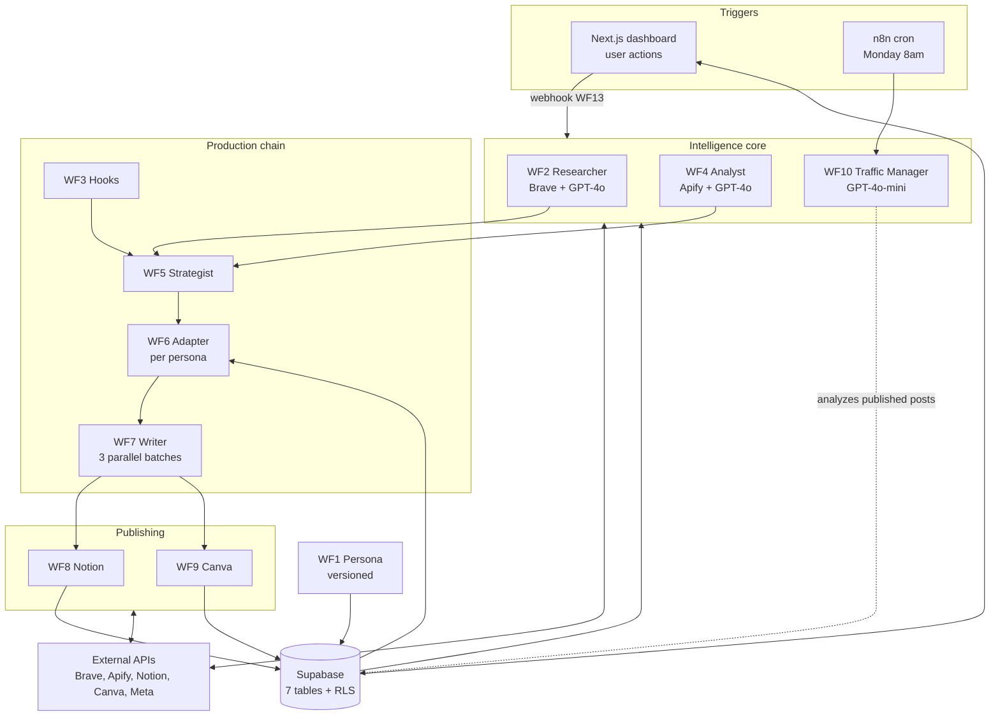

# MNS Creator

> **AI-powered content production system.**
> It researches trends, writes complete scripts, and publishes to the editorial calendar, automatically, every week, in each profile's exact voice.
> Built by Mind in Shift to run internally across the agency's 3 profiles (institutional, partner, technical lead) before any external sale.

   

> 📌 This repository is a technical case study of MNS Creator. The source code is closed. Here you'll find the architecture, technical decisions, open decisions, the real state of development, and the mapped risks.

---

## The Problem

Keeping editorial consistency across more than one Instagram profile at the same time is expensive. Each profile needs trend research, topic definition, an original script, calendar publishing, a creative briefing, and metrics reading for adjustment. For a single profile, you can do it by hand. For three, it becomes unfeasible without hiring a social media team.

The intuitive first reaction is to automate with AI. But then the second problem shows up: **content generated by generic AI comes out generic**. ChatGPT writes in the same tone for everyone. Notion AI produces passable sentences. Neither preserves the individual voice of each profile, and neither does the full chain of research, scripting, and automated publishing.

Mind in Shift runs 3 simultaneous profiles with distinct editorial needs:

- **The agency's institutional profile.** Corporate tone, focused on automation and AI, weekly frequency.
- **The partner's profile.** A more personal tone, content creator, focused on design and process.
- **The technical lead's profile.** A more open tone, a mix of technical and personal, focused on building and behind-the-scenes.

Without MNS Creator, keeping all 3 active required 2 hours a day from the two people who run the agency. Time that came straight out of the clients' operational work.

## The Solution

A complete content production system orchestrated across 13 n8n workflows. It receives a weekly trigger, runs the entire chain (research → analysis → strategy → writing → publishing → visual briefing → paid-traffic analysis), and returns an editorial calendar ready for review and approval through the dashboard.

The difference from generic solutions: **each profile's persona is built through a structured interview and persisted in the database**. It's not a prompt written at generation time. Every model call receives the active persona of the profile in question, assembled at runtime by a Code node before it reaches GPT-4o.

### The 3 main agents

Of the 13 workflows, three are the system's intelligence core. Each one owns a distinct layer of the chain.

**Trend Researcher (WF2).** Runs real searches via the Brave Search API with a Brazil/PT-BR filter across the agency's 4 areas (automation, AI, digital marketing, design). GPT-4o synthesizes a structured report with current trends, frequent audience questions, and 5 content ideas per area. It runs on demand before each weekly production cycle.

**Profile & Competitor Analyst (WF4).** Accesses real profile data via the Apify Instagram Scraper. It calculates engagement rate, format distribution, frequency, top time slots, and top hooks by engagement. It does the same for up to 3 competitors per niche and delivers a report with gaps, opportunities, and a 30-day action plan.

**Traffic Manager (WF10).** Analyzes the week's posts, scores each one from 0 to 100 on its Meta Ads potential, and selects the best 5 to 7. For each selected post it delivers a complete briefing: objective, detailed target audience, creative copy, budget per phase, Meta Ads technical settings, and warnings before launching the campaign.

### Weekly pipeline

| # | Workflow | Function | Status |
|---|---|---|---|
| WF1 | Persona | A structured interview generates a persona persisted in the database. Versioned (a new interview creates a new version without deleting the previous one). | In production |
| WF2 | Researcher | Brave Search + GPT-4o. Synthesizes trends by area. | In production |
| WF3 | Hooks | Apify collects 12 posts per profile. Identifies hooks by engagement. | In production |
| WF4 | Analyst | Apify collects 30 posts per profile + competitors. Calculates metrics and gaps. | In production |
| WF5 | Strategist | Defines the weekly direction consuming WF2 + WF4 (with `neverError: true`). | In production |
| WF6 | Adapter | Adapts the weekly direction to each profile considering its individual persona. | In production |
| WF7 | Writer | 3 parallel batches. GPT-4o generates complete scripts per profile. | In production |
| WF8 | Notion Publisher | Publishes the editorial calendar to Notion via API. | In production |
| WF9 | Canva Briefing | Creates designs on the Canva Connect API with a structured briefing. | In production |
| WF10 | Traffic Manager | Scores posts for Meta Ads. Full briefing for the selected ones. | In production |
| WF11 | Score & Consistency | Monday 8am cron. Measures profile health. | Under construction |
| WF12 | Repurposing | Reuses high-performing content in new formats. | Under construction |
| WF13 | Dashboard Webhooks | Connects dashboard actions (approve, reject, save experience) to n8n. | Under construction |

### Dashboard

A web app in Next.js 15 + TypeScript + Tailwind, deployed on Vercel. Single login, a distinct visual identity per profile (its own color, typography, and mood for each one, not a generic interface with 3 tabs).

Design system built by Micaela: Cormorant Garamond for headings, Inter for body, a warm dark background, gold `#C9A84C` as the primary color. The interface was designed by the person who will use it.

Screens: Week's Posts, Editorial Calendar, Experience Journal (a field the WF7 Writer reads before writing the scripts), Metrics, Paid Traffic, Weekly Report, and Profile.

Interaction is operational, not conversational. The user approves a post, rejects it (triggering an automatic rewrite), opens the Canva link, saves the week's experience. Each action fires a webhook to n8n via WF13.

---

## Architecture

```mermaid
flowchart TB
    subgraph Gatilhos["Triggers"]
        Dashboard["Next.js dashboard<br/>user actions"]
        Cron["n8n cron<br/>Monday 8am"]
    end

    subgraph Inteligencia["Intelligence core"]
        WF2["WF2 Researcher<br/>Brave + GPT-4o"]
        WF4["WF4 Analyst<br/>Apify + GPT-4o"]
        WF10["WF10 Traffic Manager<br/>GPT-4o-mini"]
    end

    subgraph Producao["Production chain"]
        WF3["WF3 Hooks"]
        WF5["WF5 Strategist"]
        WF6["WF6 Adapter<br/>per persona"]
        WF7["WF7 Writer<br/>3 parallel batches"]
    end

    subgraph Publicacao["Publishing"]
        WF8["WF8 Notion"]
        WF9["WF9 Canva"]
    end

    Supabase[("Supabase<br/>7 tables + RLS")]
    Persona["WF1 Persona<br/>versioned"]

    Externas["External APIs<br/>Brave, Apify, Notion, Canva, Meta"]

    Dashboard -->|webhook WF13| Inteligencia
    Cron --> WF10

    Persona --> Supabase
    Supabase --> WF6
    Supabase --> Inteligencia

    WF2 --> WF5
    WF4 --> WF5
    WF3 --> WF5
    WF5 --> WF6
    WF6 --> WF7
    WF7 --> WF8
    WF7 --> WF9
    WF8 --> Supabase
    WF9 --> Supabase

    WF10 -.->|analyzes published posts| Supabase

    Inteligencia <--> Externas
    Publicacao <--> Externas

    Supabase --> Dashboard
```

### Layers

| Layer | Technology | Version |
|---|---|---|
| Dashboard | Next.js + TypeScript + Tailwind | v15 |
| Orchestration | n8n self-hosted | current |
| Main model | OpenAI GPT-4o (strategy, writing, analysis) | API |
| Evaluation model | OpenAI GPT-4o-mini (scoring, briefings, hooks) | API |
| Research | Brave Search API with a BR/PT-BR filter | API |
| Instagram scraping | Apify Instagram Scraper (actor `apify/instagram-scraper`) | API |
| Editorial publishing | Notion API | API |
| Visual | Canva Connect API | API |
| Database | Supabase PostgreSQL (São Paulo region) | v16 |
| Dashboard hosting | Vercel | n/a |
| n8n hosting | Hostinger VPS, Ubuntu + Docker Swarm | n/a |

### Database schema

7 tables in Supabase with RLS configured and `updated_at` triggers:

- **`users`**. Dashboard users. Single login.
- **`persona_templates`**. Structured interview templates (the questions WF1 asks).
- **`personas`**. Personas generated by the interviews, versioned per profile. The system always uses the active version.
- **`diario_vivencias`**. A field the user fills in weekly. The WF7 Writer reads it before writing the scripts, to add personal context.
- **`post_tracking`**. Generated posts, status (draft, approved, published), engagement when applicable.
- **`weekly_reports`**. Weekly reports consolidated per profile.
- **`execution_logs`**. A structured log of every workflow execution (success, error, payload).

Plus a storage bucket for visual assets.

---

## Technical decisions

Some choices were worth debating before they became code.

### 1. Persona persisted in the database, not in the prompt

**Decision.** Each profile's persona is generated via a structured interview (WF1), persisted in Supabase, and versioned. Each GPT-4o call assembles the context via a Code node, reading the active version of the profile's persona.

**Why.** A creator's voice evolves. A persona inside the prompt is frozen at the moment it was written; a persona in the database evolves with new interviews without touching a workflow. Versioning keeps the history (each new interview creates a new version, the previous one doesn't disappear) and allows a rollback if the new version comes out worse.

**Trade-off.** One more database read per execution. Negligible added latency for our case, but at industrial scale it would need caching.

**Would I do it again.** Yes. A static persona in the prompt would be unsustainable for a system meant to run for years.

### 2. n8n self-hosted, not an agent framework (Mastra, LangGraph, AutoGen)

**Decision.** All orchestration in self-hosted n8n, the same stack as the rest of the agency (Docker Swarm + Postgres + Redis).

**Why.** I already have a consolidated operation in n8n. 13 visually connected workflows, debuggable node by node, with a history of every execution, are worth more than abstract code in an agent framework that's still maturing. The visual editor also lets Micaela navigate the flows without needing to understand code.

**Trade-off.** In some specific chains (complex loops with dynamic decisions), an agent framework would be more natural. n8n requires modeling with Switch + IF, which inflates the node count.

**Would I do it again.** Yes. Stack diversity only makes sense when the problem justifies it. It doesn't here.

### 3. Apify for Instagram, not a custom scraper

**Decision.** Instagram data collection via the Apify Instagram Scraper (HTTP Request with `httpHeaderAuth` credential, actor `apify/instagram-scraper`, `resultsType: posts`).

**Why.** Outsourced risk. Instagram scraping is a continuous war (Meta changes the DOM, blocks IPs, requires login). Maintaining a custom scraper is permanent work that adds no value for the agency. Apify keeps the actor updated and we pay only for the collections (not continuous calls).

**Trade-off.** A recurring cost (about US$0.15 per 1,000 posts collected). For internal use it's viable. To scale to clients, map it into the pricing model.

**Would I do it again.** Yes. The time spent maintaining a custom scraper would cost far more than the subscription.

### 4. A GPT-4o + GPT-4o-mini model split, not a single model

**Decision.** GPT-4o for creative and strategic tasks (Researcher WF2, Strategist WF5, Writer WF7). GPT-4o-mini for structured evaluations (Score, Briefings, Hooks).

**Why.** Cost. Scoring a post for Meta Ads is a structured task with fixed-format output; GPT-4o-mini handles it with equivalent quality for a fraction of the price. Script writing, on the other hand, needs GPT-4o's deeper reasoning.

**Trade-off.** One more model in the inventory, one more regression test when the split changes.

**Would I do it again.** Yes. At scale, the cost difference pays off a lot.

### 5. Error handling with `neverError: true` on cascading calls

**Decision.** The WF5 Strategist calls WF2 (Researcher) and WF4 (Analyst) with `neverError: true` on the Execute Workflow node.

**Why.** The entire chain has 13 workflows. If any call breaks and aborts the pipeline, the weekly production doesn't happen. `neverError: true` makes the break propagate as data (`{ "error": ... }`), which WF5 handles with conditional logic. The cycle proceeds with what it has.

**Trade-off.** If the failure is serious (e.g., Brave Search returned empty due to a critical bug), the cycle proceeds with bad data until someone notices. Offset by the structured log in Supabase, which fires an alert on recurring errors.

**Would I do it again.** Yes. A cascading chain with no fallback is far too fragile for real production.

---

## Open decisions still to make

Unlike the closed decisions, these need to be made before go-live or shortly after.

### Notion IDs: env vars or hardcode

n8n blocks access to `$env` in Code nodes by default (`N8N_BLOCK_ENV_ACCESS_IN_NODE=true`). To use the IDs of the 3 Notion databases via env:

- **Option A.** Disable `N8N_BLOCK_ENV_ACCESS_IN_NODE` on the host and use `.env`. The code stays clean, IDs kept out of the workflow.
- **Option B.** Hardcode the 3 IDs in the Profile Setup Code node. Doesn't require changing the global config.

**Leaning toward:** A. Keep the code clean and the IDs separate.

### Canva API: full programmatic creation or manual briefing

The Canva Connect API still has limited support for programmatic design creation with real content. Today WF9 creates the design but doesn't fill the slides automatically.

- **Option A.** Keep it as is: structured briefing + a link to edit manually. No dependency on an unstable Canva feature.
- **Option B.** Investigate the Canva API v2 with template filling.
- **Option C.** Replace Canva with image generation via Firefly or DALL-E directly.

**Leaning toward:** keep A in the MVP, evaluate B after the first production cycle.

### When to run the full happy path with real personas

All workflows were validated individually. The complete path WF1 → WF7 has never been run end to end because the `personas` table is empty (we haven't done the interviews with each profile yet).

- **Option A.** Run it before WF13 (with no dashboard connected). Faster validation, but manual operation.
- **Option B.** Wait for WF13 to finish so the dashboard is connected for the first real validation.

**Leaning toward:** B. It's worth waiting a week to fully validate the dashboard → n8n → Notion publishing flow.

---

## Current state

**In pre-launch. Internal go-live on June 20, 2026.**

| Indicator | Value |
|---|---|
| Workflows in production | **10 of 13** |
| Workflows under construction | WF11 (Score), WF12 (Repurposing), WF13 (Dashboard Webhooks) |
| Supabase tables ready | 7 (with RLS, triggers, and a storage bucket) |
| Dashboard | Complete HTML with the design system implemented |
| Personas in the database | 0 (interviews planned for next week) |
| First real cycle | 06/20/2026 |

### Who handles what

- **Guilherme.** Infrastructure, n8n, API integrations, Supabase schema, workflows.
- **Micaela.** Next.js dashboard, design system, product copy.

### Development cadence

6 hours a week, split into 2 blocks: 3 hours Monday + 3 hours Thursday. The project runs in parallel with the agency's operation (clients in production via MNS Control + the Prospecting System).

---

## Known risks

### 1. Instagram blocking or changing scraping via Apify

**Mitigation.** Manual fallback: the user can enter metrics directly into the dashboard's experience journal. The system keeps working without WF4, losing only the enrichment from real competitor data.

### 2. The cascading chain makes weekly production fragile

13 coupled workflows. One broken one stops the whole cycle.

**Mitigation.** Every workflow has per-node error handling, a structured log in Supabase with the execution payload, and the critical calls use `neverError: true` (technical decision 5 above).

### 3. The project's execution time

6h a week is little for a system of 13 workflows + dashboard + design system. A real risk of the schedule slipping.

**Mitigation.** A batch architecture with incremental delivery. The system already produces value before it's 100% complete: today the research + analysis + strategy + writing part already runs, even without WF11/12/13 ready.

### 4. API cost at scale

GPT-4o per post, Apify per collection, Brave Search per query. For internal use (3 profiles, weekly cycle) the cost is controlled. To scale to an external client, the cost per execution needs to be mapped before pricing.

**Mitigation.** The model split (technical decision 4) already reduces cost. A detailed per-workflow mapping will be done after the first real cycle.

### 5. Personas going stale over time

A creator's voice evolves. If the persona isn't updated, the content starts to sound off after a few months.

**Mitigation.** Persona versioning (technical decision 1) allows updates without losing history. Pending: an automatic alert to review a persona after X months without an update.

---

## Roadmap

### Next 3 months

- Go-live of the complete system, with all 3 profiles producing real content weekly
- Dashboard integrated with real Supabase data (replacing mocks)
- A first validated 4-week cycle, measuring post approval rate, time saved, and publishing consistency
- WF11, WF12, and WF13 closed

### 6 to 12 months

- Enough accumulated data to measure the real impact on the profiles' growth
- Evaluate productization: document the system, map the cost per client, define an implementation model for third parties
- If validated, a first external client with implementation managed by Mind in Shift

---

## Positioning and model

Internal use first. Mind in Shift will use MNS Creator to produce its own content for the 3 profiles. Once the system is validated in real production (probably after 8 to 12 weeks of continuous operation), evaluate productization for third parties.

The same model as MNS Control: not a standalone SaaS sold by license. It would be an implementation managed by the agency, with a consultative setup (interviews to build personas, credential configuration, connecting the profiles) and a monthly operation.

The viable first external client profile: a small digital marketing agency, with 2 to 3 partners producing content simultaneously, that already uses n8n or is open to automation, and that struggles with editorial inconsistency across profiles.

---

## Stack

- **Dashboard.** Next.js 15, TypeScript, Tailwind CSS, deployed on Vercel
- **Orchestration.** n8n self-hosted (3 services: editor, worker, webhook) on Docker Swarm
- **AI model.** OpenAI GPT-4o (creative) and GPT-4o-mini (structured evaluations)
- **Research.** Brave Search API with a BR/PT-BR filter
- **Scraping.** Apify Instagram Scraper
- **Database.** Supabase PostgreSQL v16 (São Paulo region), 7 tables with RLS, triggers, and a storage bucket
- **Editorial publishing.** Notion API
- **Visual.** Canva Connect API
- **Hosting.** Vercel (dashboard), Hostinger VPS, Ubuntu (n8n, operational database)

---

## About

Built by [Guilherme Bosco](https://github.com/Guilherme-Bosco) (engineering) and Micaela (product, design, and dashboard), co-founders of [Mind in Shift](https://mindinshift.com.br), an automation and AI agency in Jacareí-SP.

For contact about the product or technical consulting on automation: [contato@mindinshift.com.br](mailto:contato@mindinshift.com.br), [LinkedIn](https://www.linkedin.com/in/guilherme-bosco-dos-santos-012bb620b/).
